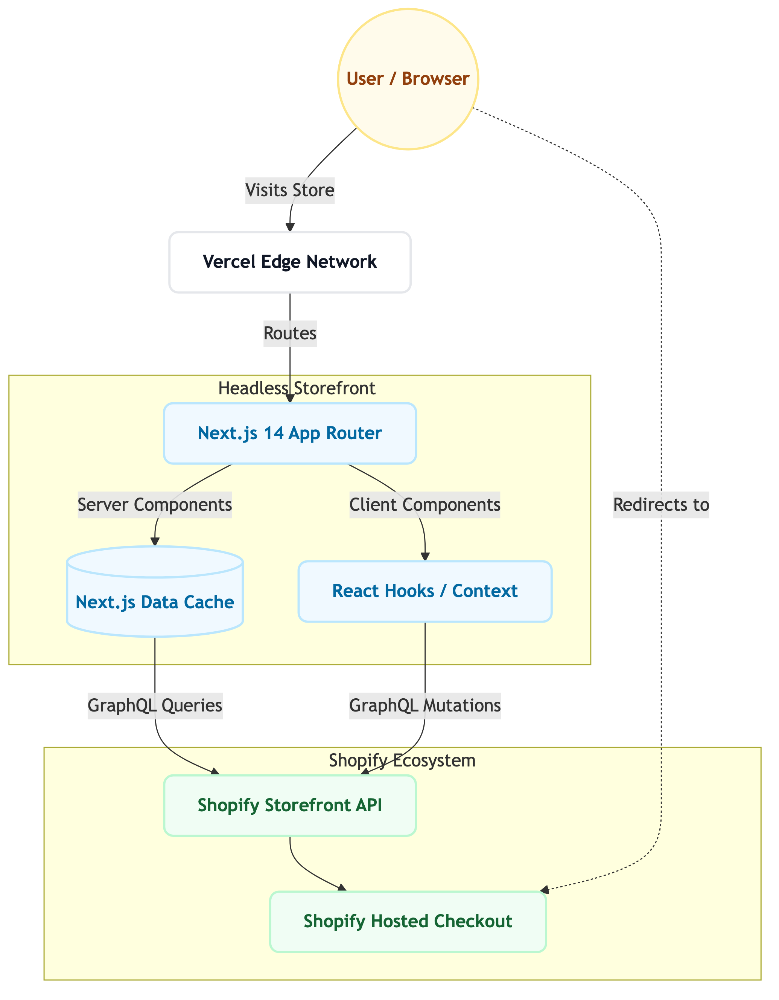
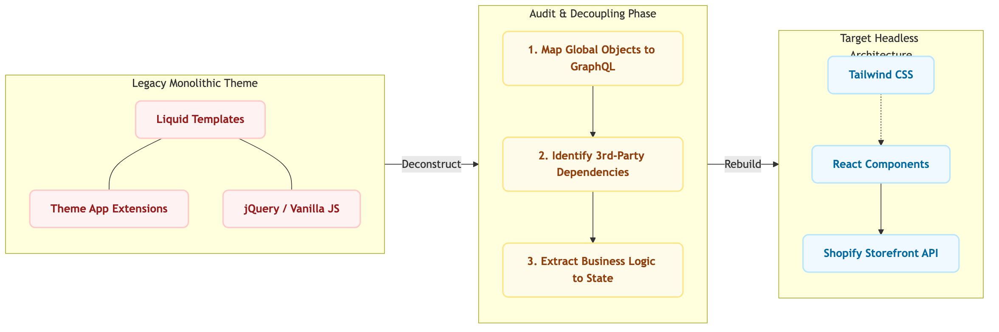

# Shopify Headless Storefront Architecture

This document outlines the high-level architecture of the Next.js 14 custom storefront and the theoretical Liquid-to-Headless migration flow mapped out in the documentation.

## 1. Modern Headless Flow (Next.js App Router)

Showcasing the data flow from the end-user to the Shopify ecosystem, utilizing Next.js Server Components, fetch caching, and client-side mutations for cart management.

---

## 2. Liquid to Headless Migration Methodology

Visualizing the auditing and decoupling process required to move a specific feature (e.g., a custom product configurator) from a legacy monolithic Liquid theme to a decoupled React component.

